# Cloud Infrastructure
EOS EVM public endpoint cloud infrastructure documentation.

> [!CAUTION]
> This repo is **public**, do not document [sensitive information](https://github.com/eosnetworkfoundation/engineering/blob/main/standards/secrets.md) here!

> [!IMPORTANT]
> > As an open-source software organization funded by and with obligations to our community, we make as much information publicly available as possible. However, [sensitive details](https://github.com/eosnetworkfoundation/engineering/blob/main/standards/secrets.md) are described using labels that are [distinct](https://en.wiktionary.org/wiki/distinct) and [definite](https://en.wiktionary.org/wiki/definite) without being [determinate](https://en.wiktionary.org/wiki/determinate). Documentation in the private [eos-evm-internal](https://github.com/eosnetworkfoundation/eos-evm-internal/tree/main/cloud) repo maps the indeterminate labels to our implementation-specific details. All of these details would be different for anyone else deploying this software stack anyways.

<!-- contents box begin -->
<table>
<tr/>
<tr>
<td width="300">
<p/>
<div align="center">
<b>Contents</b>
</div>
<p/>
<!-- contents markdown begin -->

1. [Endpoints](#endpoints)
1. [Ownership](#ownership)
1. [Context](#context)
    1. [Environments](#environments)
    1. [Datacenters](#datacenters)
    1. [Resources](#resources)
        1. [Names](#names)
        1. [Tags](#tags)
1. [System Architecture](#system-architecture)
    1. [Web Application](#web-application)
        1. [Servers](#servers)
        1. [Ports](#ports)
        1. [Target Groups](#target-groups)
        1. [Health Checks](#health-checks)
        1. [Load Balancers](#load-balancers)
        1. [TLS](#tls)
        1. [Certificates](#certificates)
        1. [Global Accelerator](#global-accelerator)
        1. [Web Application Firewall](#web-application-firewall)
    1. [DNS](#dns)
    1. [Faucet](#faucet)
    1. [Metrics](#metrics)
        1. [Alarms](#alarms)
    1. [Notifications](#notifications)
1. [Deployment Strategy](#deployment-strategy)
1. [See Also](#see-also)

<!-- contents markdown end -->
<p/>
</td>
</tr>
</table>
<!-- contents box end -->

## Endpoints
The community maintains the following endpoints for the public to interact with the EOS EVM.

Endpoint | Mainnet | Testnet | Notes
--- | :---: | :---: | ---
**API** | `api.evm.eosnetwork.com` | `api.testnet.evm.eosnetwork.com` | RPC API for tools like [Frame](https://frame.sh), [MetaMask](https://metamask.io), and [Rabby](https://rabby.io) to interact with the EOS EVM without running a full node.
**Bridge** | [bridge.evm.eosnetwork.com](https://bridge.evm.eosnetwork.com) | [bridge.testnet.evm.eosnetwork.com](https://bridge.testnet.evm.eosnetwork.com) | Trustless bridge to move EOS tokens between the native chain and the EVM.
**Explorer** | [explorer.evm.eosnetwork.com](https://explorer.evm.eosnetwork.com) | [explorer.testnet.evm.eosnetwork.com](https://explorer.testnet.evm.eosnetwork.com) | Block explorer and transaction viewer, running a [fork](https://github.com/eosnetworkfoundation/blockscout) of [Blockscout](https://www.blockscout.com).
**Faucet** | - | [faucet.testnet.evm.eosnetwork.com](https://faucet.testnet.evm.eosnetwork.com) | Obtain EOS tokens for testing. The faucet is run by [EOS Nation](https://eosnation.io).

## Ownership
Ownership ultimately lies with the community, which chose to use on-chain consensus mechanisms to delegate a leadership role over EOS EVM core software development and public endpoint operations to the [EOS Network Foundation](https://eosnetwork.com). The ENF collaborates with community contributors such as [EOS Labs](https://www.eoslabs.io), [EOS Nation](https://eosnation.io), and independent contributors to accomplish these goals.

Responsibility for EOS EVM public endpoint operations is shared between several teams.
- **ENF Automation**
    - Amazon Web Services (AWS) accounts, identity, and access management (IAM).
    - Cloud network infrastructure for the API, bridge, and explorer.
    - Cost analysis for ENF infrastructure.
    - Domain Name Service (DNS) for all endpoints.
- **ENF Engineering**
    - Compute.
    - Core software development, including frontend.
    - Database management.
    - Deployment and upgrades of EVM core components.
- **ENF Operations**
    - Billing for the API, bridge, and explorer.
- **EOS Nation**
    - Faucet API, backend, billing, cloud infrastructure, and frontend.

> [!NOTE]
> > **2024-03-07**  
> > EOS Labs recently volunteered to run the public endpoints. That means they will become responsible for all list elements above, except for core software development and probably the faucet.

## Context
The EOS EVM infrastructure is hosted on Amazon Web Services (AWS) and deployed manually.

### Environments
There are currently two environments, a staging environment using the testnet chain and a production environment using the mainnet chain. Each environment is deployed to a different AWS account.

Environment | Chain | AWS Account
--- | --- | ---
Production | EOS EVM Mainnet | `evm-mainnet`
Staging | EOS EVM Testnet | `evm-testnet`

The cloud network infrastructure is intentionally kept identical between all environments to increase the likelihood that bugs are discovered before changes are deployed to production.

### Datacenters
Each environment spans multiple [AWS regions](https://aws.amazon.com/about-aws/global-infrastructure/regions_az), which are helpful to think of as datacenters.

Name | Region
--- | ---
`ap` | Asia-Pacific
`us` | United States

All systems use multiple availability zones (AZs) within each region, where applicable.

> [!TIP]
> > Globally distributed datacenters minimize the latency to users and maximize fault tolerance. Catastrophic failure of multiple availability zones in a single region is possible, both [on accident](https://www.theregister.com/2023/04/26/google_cloud_outage) and [on purpose](https://www.wired.com/story/far-right-extremist-allegedly-plotted-blow-up-amazon-data-centers).

### Resources
AWS supports user-defined names and tags to help identify resources.

#### Names
Resource names are intended to be unique and specific enough that they are unambiguous, without being so specific that they aren't safe to discuss in an open forum. The naming schema is...
```js
// AWS account name schema
account = `${product || repo}-${environment}`
// AWS resource name schema
resource = `${account}-${datacenter}-${system}-${service}-${component}-${version}`
```
...where:
- **component** - (optional) friendly name used to differentiate components, such as one virtual machine (VM) running a database and another VM running a web server.
- **datacenter** - documented [above](#datacenters).
- **environment** - explained [above](#environments).
- **service** - shorthand for the [AWS service](https://aws.amazon.com/about-aws/global-infrastructure/regional-product-services) containing this resource.
- **system** - the larger system or deployment this resource is a part of.
- **version** - (optional) semantic version of software deployed to this resource, used only when resources are deployed concurrently with different versions.

Here are some examples.
```
evm-mainnet-ap-api-vm-miner-v0.1.1
evm-testnet-us-explorer-lb
```

#### Tags
In addition to the default tags populated by AWS, resources are tagged with the following to provide traceability.

Tag | Type | Deployment | Description
--- | :---: | :---: | ---
`billing-use` | Enum | All | Used for cost analysis in the management account (e.g. `evm-api`).
`branch` | String | Automated | The `git` branch containing the code for this resource, if any.
`build` | URL | Automated | The URL of the CI/CD build that deployed this resource.
`commit` | SHA-1 | Automated | The `git` commit containing the code for this resource, if any.
`email` | Email | All | The email address of the individual who deployed this resource.
`env` | Enum | All | The environment this resource belongs to (`prod`, `staging`, `dev`, etc.).
`manual` | Boolean | All | Whether this resource was deployed manually or by an automated system.
`repo` | URL | Any | The URL of the GitHub repository containing the code for this resource, if any.
`tag` | String | Any | The `git` tag containing the code for this resource, if any.
`ticket` | URL | Manual | The ticket authorizing this resource to be deployed.

These tags can also be used as dimensions in the AWS cost analysis tool.

## System Architecture
Each [environment](#environments) contains the following systems.

System | Architecture | Notes
--- | :---: | ---
API | Web Application
Bridge | Web Application
Explorer | Web Application
Faucet | External System | Testnet only.
Metrics | AWS CloudWatch
Notifications | Event Handler

The web applications are all deployed using the exact same components, so the web application architecture will be documented once and any system-specific deviations will be described along the way.

### Web Application
The web application documentation will start from the EOS EVM core software and work outwards to the Internet.

Component | Scope
--- | :---:
Server | Availability Zone
Security Group | Datacenter
Virtual Private Cloud (VPC) | Datacenter
Target Group | Datacenter
Health Check | Datacenter
Load Balancer | Datacenter
TLS Security Policy | Datacenter
X.509 Certificate | Datacenter
Global Accelerator | Global
Web Application Firewall | Datacenter
DNS (Route 53) | Global
Metrics (CloudWatch) | Datacenter

#### Servers
The [ENF Engineering team](#ownership) deploys the EOS EVM core software on a set of virtual machines (VMs) using [Amazon EC2](https://docs.aws.amazon.com/AWSEC2/latest/UserGuide/concepts.html) instances. The [Amazon Relational Database Service](https://docs.aws.amazon.com/AmazonRDS/latest/UserGuide/Welcome.html) (RDS) is also used.

> [!NOTE]
> > **2024-03-09**
> > The author is not aware of any documentation describing the specific architecture or deployment process used for the public endpoint server infrastructure. However, the RPC API deployment does look somewhat like [this](../deployments_plan_for_CEX/readme.md).

#### Ports
Each VM exposes the application to the cloud network infrastructure through a network interface inside a [virtual private cloud](https://docs.aws.amazon.com/vpc/latest/userguide/what-is-amazon-vpc.html) (VPC).

System | Port | Protocol | Usage
--- | ---: | :---: | ---
**API** | 80<br/>8000 | TCP<br/>HTTP | API Traffic<br/>Health Check
**Bridge** | 80 | HTTP | Web Traffic<br/>Health Check
**Explorer** | 80 | HTTP | Web Traffic<br/>Health Check

These ports are enforced by [security groups](https://docs.aws.amazon.com/vpc/latest/userguide/vpc-security-groups.html), a simple [transport and network layer](https://en.wikipedia.org/wiki/OSI_model) AWS firewall service external to the VMs that is required and denies all traffic by default.

#### Target Groups
A [target group](https://docs.aws.amazon.com/elasticloadbalancing/latest/application/load-balancer-target-groups.html) defines a set of targets, all virtual machines in this case, to receive application traffic. This includes the port and protocol to be used for both application traffic and for health checks. Target groups will only route application traffic to targets that have satisfied the health checks.

#### Health Checks
Health checks are performed on a per-VM basis according to a specific set of user-defined rules. An HTTP or HTTPS request is sent to the VM using the specified port and path. The VM must respond in a specific amount of time with an accepted [HTTP status code](https://developer.mozilla.org/en-US/docs/Web/HTTP/Status). Any payload included in the response is ignored.

System | Port | Path | Protocol | Status Code | Interval (seconds) | Timeout (seconds) | Success Threshold | Failure Threshold
--- | ---: | --- | :---: | :---: | :---: | :---: | --- | ---
**API** | 8000 | `/` | HTTP | 200-299 | 30 | 5 | 5 responses | 2 requests
**Bridge** | 80 | `/` | HTTP | 200-299 | 30 | 5 | 5 responses | 2 requests
**Explorer** | 80 | `/` | HTTP | 200-299 | 30 | 5 | 5 responses | 2 requests

A virtual machine must meet the success threshold using **_consecutive_** responses to transition into the healthy state and begin receiving traffic. The failure threshold is also determined using **_consecutive_** timeouts or bad status codes.

> [!IMPORTANT]
> > [Global Accelerator](#global-accelerator) also performs health checks, which are configured separately but are intentionally kept as similar as possible.

#### Load Balancers
An [application load balancer](https://docs.aws.amazon.com/elasticloadbalancing/latest/application/introduction.html) (ALB) operates at the application layer of the [OSI model](https://en.wikipedia.org/wiki/OSI_model) to evenly distribute client traffic between one or more healthy targets, VMs in this case, as determined by [target groups](#target-groups).

> [!TIP]
> > These ALBs use a routing algorithm known as "least outstanding requests" to distribute traffic among healthy targets within a target group. This algorithm is designed to distribute incoming requests evenly across all healthy targets within the target group based on the number of outstanding requests each target is currently serving. This helps optimize resource utilization and prevents any single target from being overwhelmed with traffic.


Logically, ALBs map client requests from [listeners](https://docs.aws.amazon.com/elasticloadbalancing/latest/application/load-balancer-listeners.html) to target groups according to user-defined rules.

<!-- listener table begin -->
<table>
<tr/>

<tr>
<td align="center"><b>System</b></td>
<td align="center"><b>Listener</b></td>
<td align="center"><b>Rule</b></td>
</tr>

<!-- API -->
<tr>
<td rowspan="2"><b>API</b></td>
<td align="right">80</td>
<td>HTTP 301 redirect to <code>https://${host}:443/${path}?${query}</code>.</td>
</tr>

<tr>
<td align="right">443</td>
<td>Forward to target group.</td>
</tr>

<!-- Bridge -->
<tr>
<td rowspan="2"><b>Bridge</b></td>
<td align="right">80</td>
<td>HTTP 301 redirect to <code>https://${host}:443/${path}?${query}</code>.</td>
</tr>

<tr>
<td align="right">443</td>
<td>Forward to target group.</td>
</tr>

<!-- Explorer -->
<tr>
<td rowspan="2"><b>Explorer</b></td>
<td align="right">80</td>
<td>HTTP 301 redirect to <code>https://${host}:443/${path}?${query}</code>.</td>
</tr>

<tr>
<td align="right">443</td>
<td>Forward to target group.</td>
</tr>
</table>
<!-- listener table end -->

> [!TIP]
> > Application load balancers sit behind a [security group](https://docs.aws.amazon.com/vpc/latest/userguide/vpc-security-groups.html), a simple network and transport layer firewall native to AWS that enforces these ports, just like VM network interfaces.

ALBs have some additional attributes.

<!-- attribute table begin -->
<table>
<tr/>

<tr>
<td align="center"><b>System</b></td>
<td align="center"><b>Attribute</b></td>
<td align="center"><b>State</b></td>
<td align="center"><b>Description</b></td>
</tr>

<!-- API -->
<tr>
<td rowspan="6"><b>API</b></td>
<td>HTTP/2</td>
<td align="center">On</td>
<td>Support HTTP/2, and use it by default.</td>
</tr>

<tr>
<td>Drop invalid header fields</td>
<td align="center">Off</td>
<td>Strip invalid HTTP headers from requests.</td>
</tr>

<tr>
<td>Preserve <code>HOST</code> header</td>
<td align="center">Off</td>
<td>Preserve client <code>HOST</code> HTTP header for server.</td>
</tr>

<tr>
<td><code>X-Forwarded-For</code> header</td>
<td align="center">Append</td>
<td>Pack client information in the <code>X-Forwarded-For</code> HTTP header for the server.</td>
</tr>

<tr>
<td>Client port preservation</td>
<td align="center">On</td>
<td>Include client origin port in <code>X-Forwarded-For</code> header.</td>
</tr>

<tr>
<td>TLS version and cipher headers</td>
<td align="center">On</td>
<td>Include <code>x-amzn-tls-version</code> and <code>x-amzn-tls-cipher-suite</code> in <code>X-Forwarded-For</code> header.</td>
</tr>

<!-- Bridge -->
<tr>
<td rowspan="6"><b>Bridge</b></td>
<td>HTTP/2</td>
<td align="center">On</td>
<td>Support HTTP/2, and use it by default.</td>
</tr>

<tr>
<td>Drop invalid header fields</td>
<td align="center">Off</td>
<td>Strip invalid HTTP headers from requests.</td>
</tr>

<tr>
<td>Preserve <code>HOST</code> header</td>
<td align="center">Off</td>
<td>Preserve client <code>HOST</code> HTTP header for server.</td>
</tr>

<tr>
<td><code>X-Forwarded-For</code> header</td>
<td align="center">Append</td>
<td>Pack client information in the <code>X-Forwarded-For</code> HTTP header for the server.</td>
</tr>

<tr>
<td>Client port preservation</td>
<td align="center">On</td>
<td>Include client origin port in <code>X-Forwarded-For</code> header.</td>
</tr>

<tr>
<td>TLS version and cipher headers</td>
<td align="center">On</td>
<td>Include <code>x-amzn-tls-version</code> and <code>x-amzn-tls-cipher-suite</code> in <code>X-Forwarded-For</code> header.</td>
</tr>

<!-- Explorer -->
<tr>
<td rowspan="6"><b>Explorer</b></td>
<td>HTTP/2</td>
<td align="center">On</td>
<td>Support HTTP/2, and use it by default.</td>
</tr>

<tr>
<td>Drop invalid header fields</td>
<td align="center">Off</td>
<td>Strip invalid HTTP headers from requests.</td>
</tr>

<tr>
<td>Preserve <code>HOST</code> header</td>
<td align="center">Off</td>
<td>Preserve client <code>HOST</code> HTTP header for server.</td>
</tr>

<tr>
<td><code>X-Forwarded-For</code> header</td>
<td align="center">Append</td>
<td>Pack client information in the <code>X-Forwarded-For</code> HTTP header for the server.</td>
</tr>

<tr>
<td>Client port preservation</td>
<td align="center">On</td>
<td>Include client origin port in <code>X-Forwarded-For</code> header.</td>
</tr>

<tr>
<td>TLS version and cipher headers</td>
<td align="center">On</td>
<td>Include <code>x-amzn-tls-version</code> and <code>x-amzn-tls-cipher-suite</code> in <code>X-Forwarded-For</code> header.</td>
</tr>
</table>
<!-- attribute table end -->

#### TLS
The EOS EVM public endpoints require clients to use [HTTPS](https://en.wikipedia.org/wiki/HTTPS) with [TLS](https://en.wikipedia.org/wiki/Transport_Layer_Security) to connect. [TLS termination](https://medium.com/@reach2shristi.81/ssl-tls-termination-b7cc7de3eb54) is performed at the [load balancers](#load-balancers) using an [X.509 certificate](https://en.wikipedia.org/wiki/X.509) from [AWS Certificate Manager](https://docs.aws.amazon.com/acm/latest/userguide/acm-overview.html) (ACM) according to rules defined by any one of several [AWS-provided security policies](https://docs.aws.amazon.com/elasticloadbalancing/latest/network/create-tls-listener.html#describe-ssl-policies).

> [!TIP]
> > The TLS specification requires servers to select the latest TLS version the client supports.  
> > All TLS v1.3 and `ECDHE-*` cipher suites guarantee [forward secrecy](https://en.wikipedia.org/wiki/Forward_secrecy).

<!-- tls table begin -->
<table>
<tr/>

<tr>
<td align="center"><b>System</b></td>
<td align="center"><b>Security Policy</b></td>
<td align="center"><b>TLS Version</b></td>
<td align="center"><b>Cipher Suite</b></td>
</tr>

<!-- API -->
<tr>
<td rowspan="2"><b>API</b></td>
<td rowspan="2"><code>ELBSecurityPolicy-TLS13-1-2-Res-2021-06</code></td>
<td align="center">TLS v1.2</td>
<td><code>ECDHE-ECDSA-AES128-GCM-SHA256</code><br/><code>ECDHE-ECDSA-AES256-GCM-SHA384</code><br/><code>ECDHE-RSA-AES128-GCM-SHA256</code><br/><code>ECDHE-RSA-AES256-GCM-SHA384</code></td>
</tr>

<tr>
<td align="center">TLS v1.3</td>
<td><code>TLS_AES_128_GCM_SHA256</code><br/><code>TLS_AES_256_GCM_SHA384</code><br/><code>TLS_CHACHA20_POLY1305_SHA256</code></td>
</tr>

<!-- Bridge -->
<tr>
<td rowspan="2"><b>Bridge</b></td>
<td rowspan="2"><code>ELBSecurityPolicy-TLS13-1-2-Res-2021-06</code></td>
<td align="center">TLS v1.2</td>
<td><code>ECDHE-ECDSA-AES128-GCM-SHA256</code><br/><code>ECDHE-ECDSA-AES256-GCM-SHA384</code><br/><code>ECDHE-RSA-AES128-GCM-SHA256</code><br/><code>ECDHE-RSA-AES256-GCM-SHA384</code></td>
</tr>

<tr>
<td align="center">TLS v1.3</td>
<td><code>TLS_AES_128_GCM_SHA256</code><br/><code>TLS_AES_256_GCM_SHA384</code><br/><code>TLS_CHACHA20_POLY1305_SHA256</code></td>
</tr>

<!-- Explorer -->
<tr>
<td rowspan="2"><b>Explorer</b></td>
<td rowspan="2"><code>ELBSecurityPolicy-TLS13-1-2-Res-2021-06</code></td>
<td align="center">TLS v1.2</td>
<td><code>ECDHE-ECDSA-AES128-GCM-SHA256</code><br/><code>ECDHE-ECDSA-AES256-GCM-SHA384</code><br/><code>ECDHE-RSA-AES128-GCM-SHA256</code><br/><code>ECDHE-RSA-AES256-GCM-SHA384</code></td>
</tr>

<tr>
<td align="center">TLS v1.3</td>
<td><code>TLS_AES_128_GCM_SHA256</code><br/><code>TLS_AES_256_GCM_SHA384</code><br/><code>TLS_CHACHA20_POLY1305_SHA256</code></td>
</tr>
</table>
<!-- tls table end -->

#### Certificates
The [load balancers](#load-balancers) obtain [X.509 certificates](https://en.wikipedia.org/wiki/X.509) from [AWS Certificate Manager](https://docs.aws.amazon.com/acm/latest/userguide/acm-overview.html) (ACM). These certificates are issued by [Amazon Trust Services](https://www.amazontrust.com/repository), a public [certificate authority](https://en.wikipedia.org/wiki/Certificate_authority) (CA) operated by Amazon Web Services, and are used by clients to verify the identity of the server.

> [!TIP]
> > Certificate authorities require proof of ownership over domain names in order to issue a certificate. This is accomplished with ACM by adding a `CNAME` DNS record for each domain name listed on a certificate. ACM will automatically renew the certificate as long as the `CNAME` records are present.

Certificates are issued separately for each [region](#datacenters) in each [environment](#environments).

<!-- cert table begin -->
<table>
<tr/>

<tr>
<td align="center"><b>Chain</b></td>
<td align="center"><b>Region</b></td>
<td align="center"><b>Certificate</b></td>
<td align="center"><b>Algorithm</b></td>
<td align="center"><b>Alternative Names</b></td>
</tr>

<!-- mainnet -->
<tr>
<td rowspan="2"><b>mainnet</b></td>
<td align="center"><code>ap</code></td>
<td align="right"><code>evm.eosnetwork.com</code></td>
<td align="center">ECDSA<br/>NIST P-384</td>
<td align="right"><code>evm.eosnetwork.com</code><br/><code>api.evm.eosnetwork.com</code><br/><code>bridge.evm.eosnetwork.com</code><br/><code>explorer.evm.eosnetwork.com</code></td>
</tr>

<tr>
<td align="center"><code>us</code></td>
<td align="right"><code>evm.eosnetwork.com</code></td>
<td align="center">ECDSA<br/>NIST P-384</td>
<td align="right"><code>evm.eosnetwork.com</code><br/><code>api.evm.eosnetwork.com</code><br/><code>bridge.evm.eosnetwork.com</code><br/><code>explorer.evm.eosnetwork.com</code></td>
</tr>

<!-- testnet -->
<tr>
<td rowspan="2"><b>testnet</b></td>
<td align="center"><code>ap</code></td>
<td align="right"><code>testnet.evm.eosnetwork.com</code></td>
<td align="center">ECDSA<br/>NIST P-384</td>
<td align="right"><code>testnet.evm.eosnetwork.com</code><br/><code>api.testnet.evm.eosnetwork.com</code><br/><code>bridge.testnet.evm.eosnetwork.com</code><br/><code>explorer.testnet.evm.eosnetwork.com</code><br/><code>faucet.testnet.evm.eosnetwork.com</code></td>
</tr>

<tr>
<td align="center"><code>us</code></td>
<td align="right"><code>testnet.evm.eosnetwork.com</code></td>
<td align="center">ECDSA<br/>NIST P-384</td>
<td align="right"><code>testnet.evm.eosnetwork.com</code><br/><code>api.testnet.evm.eosnetwork.com</code><br/><code>bridge.testnet.evm.eosnetwork.com</code><br/><code>explorer.testnet.evm.eosnetwork.com</code><br/><code>faucet.testnet.evm.eosnetwork.com</code></td>
</tr>
</table>
<!-- cert table end -->

All domain names used across all systems are listed on each certificate so that if engineering shares resources between systems, such as calling the API or embedding the bridge on the explorer site, it will not violate browser [content security policy](https://developer.mozilla.org/en-US/docs/Web/HTTP/CSP) or [same-origin policy](https://developer.mozilla.org/en-US/docs/Web/Security/Same-origin_policy).

#### Global Accelerator
[AWS Global Accelerator](https://docs.aws.amazon.com/global-accelerator/latest/dg/what-is-global-accelerator.html) is used to improve the performance and availability of the EOS EVM public endpoints by ingesting client traffic at the nearest [edge location](https://aws.amazon.com/global-accelerator/features), routing it to the closest healthy endpoint over private fiber as priority traffic instead of traversing the public Internet.

Global Accelerator determines where to send client requests according to the following rules.
1. **Proximity-Based Routing** - route traffic to the [datacenter](#datacenters) nearest to the client in terms of network latency.
1. **Health-Based Routing** - route traffic to the nearest [healthy](#health-checks) endpoint, providing automatic global [failover](https://en.wikipedia.org/wiki/Failover) in the event of partial service outage.

> [!NOTE]
> > Global Accelerator is **_not_** a [content delivery network](https://en.wikipedia.org/wiki/Content_delivery_network) (CDN).  
> > Work is planned to migrate the [bridge](https://github.com/eosnetworkfoundation/eos-evm-contract/issues/444) and the [explorer](https://github.com/eosnetworkfoundation/eos-evm-contract/issues/445) to a CDN.

Amazon [claims](https://aws.amazon.com/global-accelerator/faqs):
> For TCP traffic, as measured by third-party real user measurement tools at the 90th percentile (p90), Global Accelerator decreases first byte latency by up to 49%, jitter by up to 58%, and improves throughput by up to 60%. [...] "By enabling AWS Global Accelerator, one [...] customer [saw](https://aws.amazon.com/solutions/case-studies/lever-case-study) a 51.2% reduction in mean end-to-end app load times." [[Another](https://aws.amazon.com/solutions/case-studies/skyscanner-case-study) customer] was able to "decrease response time from more than 200 milliseconds to less than 4 milliseconds, a 98% improvement."

> [!TIP]
> > AWS offers a nifty [website](https://speedtest.globalaccelerator.aws) that enables the user to race requests of various sizes over Global Accelerator against the public Internet to various regions around the world.

Global Accelerator offers some configuration options.

<!-- global accelerator table begin -->
<table>
<tr/>

<tr>
<td rowspan="2" align="center"><b>System</b></td>
<td colspan="2" align="center"><b>Listener</b></td>
<td colspan="2" align="center"><b>Target</b></td>
<td colspan="4" align="center"><b>Health Check</b></td>
</tr>

<tr>
<td align="center"><b>Port</b></td>
<td align="center"><b>Protocol</b></td>
<td align="center"><b>Load Balancer</b></td>
<td align="center"><b>Weight</b></td>
<td align="center"><b>Port</b></td>
<td align="center"><b>Protocol</b></td>
<td align="center"><b>Interval</b><br/>(seconds)</td>
<td align="center"><b>Threshold</b></td>
</tr>

<!-- API -->
<tr>
<td rowspan="2"><b>API</b></td>
<td rowspan="2" align="right">80<br/>443</td>
<td rowspan="2" align="center">TCP</td>
<td align="center"><code>*-ap-api-lb</code></td>
<td align="center">100</td>
<td rowspan="2" align="right">8000</td>
<td rowspan="2" align="center">TCP</td>
<td rowspan="2" align="center">30</td>
<td rowspan="2" align="center">3 requests</td>
</tr>

<tr>
<td align="center"><code>*-us-api-lb</code></td>
<td align="center">100</td>
</tr>

<!-- Bridge -->
<tr>
<td rowspan="2"><b>Bridge</b></td>
<td rowspan="2" align="right">80<br/>443</td>
<td rowspan="2" align="center">TCP</td>
<td align="center"><code>*-ap-bridge-lb</code></td>
<td align="center">100</td>
<td rowspan="2" align="right">80</td>
<td rowspan="2" align="center">TCP</td>
<td rowspan="2" align="center">30</td>
<td rowspan="2" align="center">3 requests</td>
</tr>

<tr>
<td align="center"><code>*-us-bridge-lb</code></td>
<td align="center">100</td>
</tr>

<!-- Explorer -->
<tr>
<td rowspan="2"><b>Explorer</b></td>
<td rowspan="2" align="right">80<br/>443</td>
<td rowspan="2" align="center">TCP</td>
<td align="center"><code>*-ap-explorer-lb</code></td>
<td align="center">100</td>
<td rowspan="2" align="right">80</td>
<td rowspan="2" align="center">TCP</td>
<td rowspan="2" align="center">30</td>
<td rowspan="2" align="center">3 requests</td>
</tr>

<tr>
<td align="center"><code>*-us-explorer-lb</code></td>
<td align="center">100</td>
</tr>
</table>
<!-- global accelerator table end -->

Notice that, unlike load balancer and target group [health checks](#health-checks), the success and failure thresholds are configured together.

#### Web Application Firewall
A [web application firewall](https://docs.aws.amazon.com/waf/latest/developerguide/what-is-aws-waf.html) (WAF) is a managed service that protects web applications by using heuristics to block malicious traffic which could affect availability, compromise security, or consume excessive resources. This can include mitigation for distributed [denial-of-service](https://en.wikipedia.org/wiki/Denial-of-service_attack) (DDoS) attacks, [cross-site scripting](https://en.wikipedia.org/wiki/Cross-site_scripting) (XSS), and [SQL injection](https://en.wikipedia.org/wiki/SQL_injection) attacks. The WAF can be enforced at the [edge](https://en.wikipedia.org/wiki/Edge_computing) or at the [load balancer](#load-balancers).

> [!TIP]
> > In the AWS WAF web UI, the WAFs are called web application control lists (WACLs).

### DNS
The [domain name service](https://en.wikipedia.org/wiki/Domain_Name_System) (DNS) is a distributed system that translates human-readable domain names into IP addresses. The EOS EVM public endpoints use [Amazon Route 53](https://docs.aws.amazon.com/Route53/latest/DeveloperGuide/Welcome.html) to manage DNS records.

Control over `evm.eosnetwork.com` and all subdomains is delegated to the `evm-mainnet` AWS account by an external system. This account contains all DNS records for the mainnet endpoints along with records for [certificate](#certificates) validation.

The `evm-mainnet` account delegates control over `testnet.evm.eosnetwork.com` and all subdomains to the `evm-testnet` AWS account, which contains all DNS records for the testnet endpoints and certificate validation.

### Faucet
The EOS EVM testnet faucet is operated by [EOS Nation](https://eosnation.io) and is hosted on their cloud infrastructure. As such, the only responsibility of the `evm-testnet` AWS account is to provide [DNS records](#dns) for the faucet.

### Metrics
The EOS EVM public endpoints use [Amazon CloudWatch](https://docs.aws.amazon.com/AmazonCloudWatch/latest/monitoring/WhatIsCloudWatch.html) for metrics, dashboards, and alarms. CloudWatch is an AWS-managed service with built-in integrations to all of the other managed services used by the public endpoints, so a large number of metrics are vacuumed up by default. This includes metrics on health checks, server resource utilization, endpoint traffic analysis, the nature of malicious traffic blocked by the [web application firewall](#web-application-firewall), and more. System and application logs can be ingested and analyzed for an additional fee.

> [!TIP]
> > Metrics are not currently exported to any platform-agnostic systems such as [Prometheus](https://prometheus.io) and [Grafana](https://grafana.com), but this was originally on the roadmap and will be done as the need arises.

Cost analysis is performed using the [AWS Cost Explorer](https://docs.aws.amazon.com/awsaccountbilling/latest/aboutv2/cost-explorer.html) tool, which can be filtered by the [tags](#tags) described above.

#### Alarms
CloudWatch alarms are used to notify stakeholders when specific metrics cross specific thresholds.

<!-- alarm table begin -->
<table>
<tr/>
<tr>
<td align="center"><b>Chain</b></td>
<td align="center"><b>System</b></td>
<td align="center"><b>DC</b></td>
<td align="center"><b>Alarm</b></td>
<td align="center"><b>Fault Condition</b></td>
</tr>

<!-- mainnet -->
<tr>
<td rowspan="4"><b>mainnet</b></td>
<td rowspan="2"><b>API</b></td>
<td align="center"><code>ap</code></td>
<td><code>evm-mainnet-ap-api-tg_sick-hosts</code></td>
<td><code>UnHealthyHostCount</code> ≥ 1 for 1 datapoint(s) within 1 minute.</td>
</tr>

<tr>
<td rowspan="3" align="center"><code>us</code></td>
<td><code>evm-mainnet-us-api-tg_sick-hosts</code></td>
<td><code>UnHealthyHostCount</code> ≥ 1 for 1 datapoint(s) within 1 minute.</td>
</tr>

<tr>
<td><b>Bridge</b></td>
<td><code>evm-mainnet-us-bridge-tg_sick-hosts</code></td>
<td><code>UnHealthyHostCount</code> ≥ 1 for 1 datapoint(s) within 1 minute.</td>
</tr>

<tr>
<td><b>Explorer</b></td>
<td width="450"><code>evm-mainnet-us-explorer-tg_sick-hosts</code></td>
<td><code>UnHealthyHostCount</code> ≥ 1 for 1 datapoint(s) within 1 minute.</td>
</tr>

<!-- testnet -->
<tr>
<td rowspan="4"><b>testnet</b></td>
<td rowspan="2"><b>API</b></td>
<td align="center"><code>ap</code></td>
<td><code>evm-testnet-ap-api-tg_sick-hosts</code></td>
<td><code>UnHealthyHostCount</code> ≥ 1 for 1 datapoint(s) within 1 minute.</td>
</tr>

<tr>
<td rowspan="3" align="center"><code>us</code></td>
<td><code>evm-testnet-us-api-tg_sick-hosts</code></td>
<td><code>UnHealthyHostCount</code> ≥ 1 for 1 datapoint(s) within 1 minute.</td>
</tr>

<tr>
<td><b>Bridge</b></td>
<td><code>evm-testnet-us-bridge-tg_sick-hosts</code></td>
<td><code>UnHealthyHostCount</code> ≥ 1 for 1 datapoint(s) within 1 minute.</td>
</tr>

<tr>
<td><b>Explorer</b></td>
<td><code>evm-testnet-us-explorer-tg_sick-hosts</code></td>
<td><code>UnHealthyHostCount</code> ≥ 1 for 1 datapoint(s) within 1 minute.</td>
</tr>
</table>
<!-- alarm table end -->

All alarms defined in CloudWatch are automatically "seen" and handled by the notification system.

### Notifications
The EOS EVM public endpoint cloud infrastructure can automatically notify stakeholders about system health or security events using any combination of email, instant messaging (IM), and [SMS](https://en.wikipedia.org/wiki/SMS).

[CloudWatch](https://docs.aws.amazon.com/AmazonCloudWatch/latest/monitoring/WhatIsCloudWatch.html) automatically ingests metrics from all AWS managed services used by the public endpoints. These metrics can be used to define alarms. All [alarms](#alarms) defined in CloudWatch are automatically "seen" and handled by the notification system.

This system ingests Cloudwatch alarm state-change events using [Amazon EventBridge](https://docs.aws.amazon.com/eventbridge/latest/userguide/what-is-amazon-eventbridge.html) to put them in a [Simple Notification Service](https://docs.aws.amazon.com/sns/latest/dg/welcome.html) (SNS) "topic," like a queue. Each event contains a JSON payload with information about the alarm and the context of the state change. The [aws-cloudwatch-alarm-handler](https://github.com/eosnetworkfoundation/aws-cloudwatch-alarm-handler) is an [Amazon Lambda](https://docs.aws.amazon.com/lambda/latest/dg/welcome.html) subscribed to this topic that takes the machine-readable event information, generates a human-readable message about the alarm, then puts this message in a second SNS topic called `notify-evm`. This topic uses AWS-provided services to send the human-readable message out via email and SMS. Finally, the [telegram-bot](https://github.com/eosnetworkfoundation/telegram-bot) lambda is subscribed to the `notify-evm` topic and sends the message to stakeholders via instant messaging (IM).

```mermaid
---
title: Notification System
---
flowchart TB
    subgraph cw["`**CloudWatch**`"]
        direction LR
        metric["📊 Metric"]
        alarm["🚨 Alarm"]
        metric -.- alarm
    end

    alarm ---> |📈<br/>alarm state-change event| eventBus

    subgraph eb["`**EventBridge**`"]
        direction LR
        eventBus["🚏 Event Bus<br/><br/><code>default</code>"]
        rule["📜 Rule"]
        eventBus -.- rule
    end

    eventBus ---> |📨| topic1
    rule -.-x |source| cw
    rule -.-x |target| topic1

    subgraph sns1["`**SNS**`"]
        direction TB
        topic1["🟡 Topic<br/><br/>cloudwatch-alarm-state-change-event"]
        subscription1["🗞️ Subscription"]
        topic1 -.- subscription1
    end

    topic1 ---> |💽<br/>machine-readable event| function1
    subscription1 -.-> function1

    subgraph lambda1["`**Lambda**`"]
        direction TB
        function1["📖 Function<br/><br/><code>aws-cloudwatch-alarm-handler</code>"]
        config1["Config"]
        function1 -.- config1
    end

    function1 ---> |📄<br/>formatted text| topic2

    subgraph sns2["`**SNS**`"]
        direction TB
        topic2["🟪 Topic<br/><br/>notify-evm"]
        subscription2["🗞️ Subscription"]
        topic2 -.- subscription2
    end

    topic2 ---> |📄| function2
    topic2 ---> |📧| email
    topic2 ---> |📶| sms
    subscription2 -.-> function2

    subgraph lambda2["`**Lambda**`"]
        direction TB
        function2["🤖 Function<br/><br/><code>telegram-bot</code>"]
        config2["Config"]
        function2 -.- config2
    end

    function2 ---> |💬| im

    subgraph stakeholders["`**Stakeholders**`"]
        direction TB
        email["📥 Email"]
        sms["📲 SMS"]
        im["💻 IM"]
    end

    email -.-> |👤| subscription2
    sms -.-> |👤| subscription2
    im -.-> |🗝️👤| config2

    alarm ~~~ rule
```



For more information about the notification system components, including examples of the JSON payload and human-readable messages, check out the [aws-cloudwatch-alarm-handler](https://github.com/eosnetworkfoundation/aws-cloudwatch-alarm-handler) and [telegram-bot](https://github.com/eosnetworkfoundation/telegram-bot) GitHub repositories.

## Deployment Strategy
Infrastructure changes are **always** deployed, _one at a time_, as follows.
1. A maintenance window is scheduled with stakeholders, during which no other changes are taking place.
    - This guarantees all stakeholders are informed.
    - This reduces the number of independent variables, minimizing the time to resolution should service degradation be observed.
1. Testnet endpoint functionality is verified using a virtual private network (VPN) to perform [smoke tests](../runbooks/endpoint-smoke-test.md) against all affected endpoints, each from a number of different cities.
    - The cities selected must exercise all datacenters.
    - The set of cities should be large, to exercise content delivery networks (CDNs) or other edge compute.
    - The cities used and results observed must be written down so the tests can be reproduced.
    - If any tests fail then the deployment must be deferred until the system is in a known-good state.
1. Changes are deployed to the testnet staging environment.
1. Testnet endpoint functionality is validated using [smoke tests](../runbooks/endpoint-smoke-test.md) from the same cities as before.
1. A waiting period is observed.
    - This gives the community time to identify and report bugs.
    - This should be two business days to one week, and must be no less than twenty four (24) hours.
1. Mainnet endpoint functionality is verified using [smoke tests](../runbooks/endpoint-smoke-test.md) from a set of cities meeting the criteria above.
1. Changes are deployed to the mainnet production environment.
1. Mainnet endpoint functionality is validated using [smoke tests](../runbooks/endpoint-smoke-test.md) from the same cities as before.

If service degradation is observed at any point in this process then all changes must be reverted, and the process must start over.

## See Also
More resources.
- [`../README.md`](../README.md) ⤴
- [aws-cloudwatch-alarm-handler](https://github.com/eosnetworkfoundation/aws-cloudwatch-alarm-handler) lambda
- [eos-evm-internal](https://github.com/eosnetworkfoundation/eos-evm-internal) - internal-facing documentation of a [sensitive](https://github.com/eosnetworkfoundation/engineering/blob/main/standards/secrets.md) nature.
- [Runbooks](../runbooks/README.md)
- [telegram-bot](https://github.com/eosnetworkfoundation/telegram-bot) lambda

***
> **_Legal Notice_**  
> This repo contains assets created in collaboration with a large language model, machine learning algorithm, or weak artificial intelligence (AI). This notice is required in some countries.
